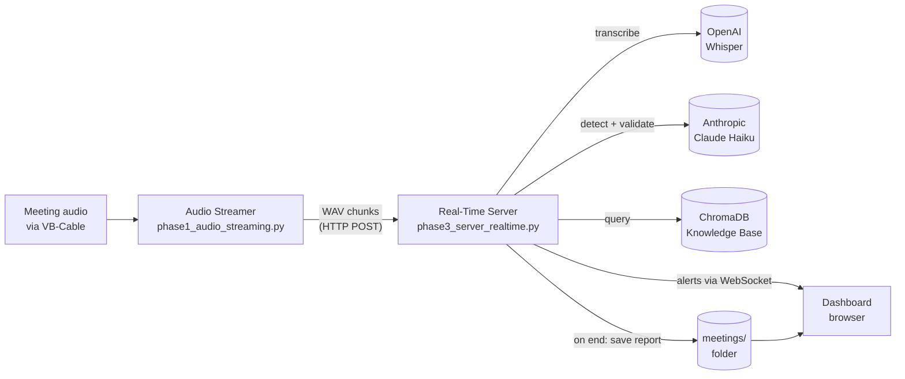
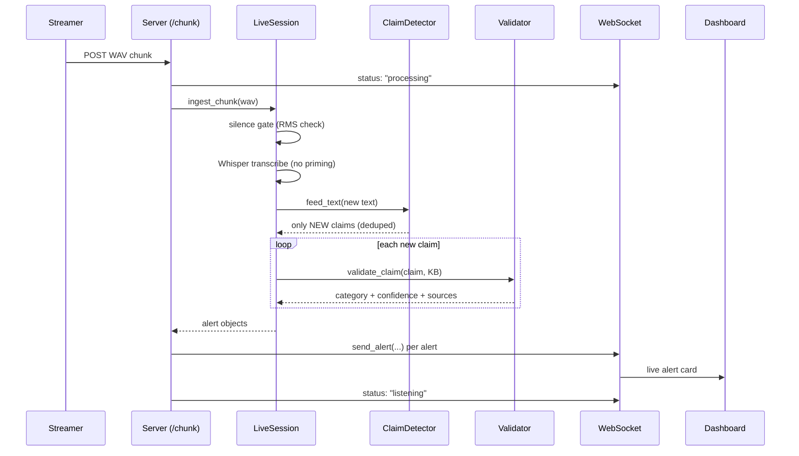

# Geppetto 2 — Architecture & Logic

*The Meeting Truth Layer: a real-time system that listens to a meeting, detects factual claims, checks them against an approved knowledge base, and privately alerts the project manager when something doesn't line up.*

This document explains how the system is put together and the logic behind each part. For a plain-language overview see `HOW_IT_WORKS.md`; to run it see `RUN_REALTIME.md`; for the full spec see `REQUIREMENTS_REALTIME.md`.

---

## 1. The big picture

Geppetto runs as **two local processes** on the PM's Windows laptop plus **two external API calls** (OpenAI Whisper for speech-to-text, Anthropic Claude for language reasoning). Nothing else leaves the machine.



Two roles, deliberately separated:

- The **streamer** owns the microphone/audio device and decides *where to cut* the audio. It's a thin, dependency-light client.
- The **server** owns all the intelligence: transcription, claim detection, validation, the live dashboard, and report storage.

This split means the heavy logic is unit-testable without audio hardware, and the streamer can be replaced (e.g. by a test harness like `test_feed_clip.py`) without touching the pipeline.

---

## 2. The processing pipeline (per audio chunk)

The core loop is: **capture → chunk → transcribe → detect new claims → validate → alert.** Each chunk of audio flows through these stages.



The key efficiency idea: claims are detected **incrementally**. The validator is only ever run on *newly seen* claims, never on the whole growing transcript. This keeps cost and latency flat as the meeting gets longer.

---

## 3. Component-by-component logic

### 3.1 Audio Streamer — `phase1_audio_streaming.py`

Captures audio from **VB-Cable** (a virtual audio device that routes meeting sound into the mic input) and streams WAV chunks to the server.

The interesting logic is the **`StreamChunker`** — a pure, testable class that decides where to cut the audio:

- **VAD-aligned cuts, not fixed time.** Instead of slicing every N seconds (which splits words mid-syllable), it cuts on natural pauses. A chunk is emitted when it's at least `MIN_CHUNK_SEC` (4s) long *and* the current frame is silence, or when it hits `MAX_CHUNK_SEC` (6s) as a hard ceiling.
- **Adaptive silence threshold.** "Silence" isn't an absolute value — it's `silence_ratio × rolling median RMS` of recent frames, with an absolute floor (`MIN_ABS_RMS`) so quiet-but-present speech isn't gated out. This adapts to different room/mic levels.
- **Overlap.** Each new chunk is seeded with ~0.5s of audio from the end of the previous one, so a word straddling a boundary isn't lost.
- **Silence gating.** Chunks that are mostly silence are dropped client-side and never sent — saving API cost and avoiding Whisper hallucinating words out of dead air.

Networking runs on a **background sender thread** with a queue, so the audio capture loop is never blocked waiting on HTTP. Failed chunk sends retry with exponential backoff (3 attempts) and are dropped with a warning rather than crashing the capture.

### 3.2 Real-Time Server — `phase3_server_realtime.py`

A FastAPI app that ties everything together and serves the dashboard. It holds the shared singletons (KB collection, storage, WebSocket manager, OpenAI client) and a dictionary of active `LiveSession`s keyed by session id.

Blocking work (transcription, validation, disk I/O) is pushed to a threadpool via `run_in_threadpool` so the async event loop stays responsive for WebSocket pushes.

On `/chunk` it: marks status "processing" → runs the session pipeline → broadcasts each resulting alert → marks status "listening". A persistent transcription failure on one chunk produces a `"warning"` to the dashboard and a `202 skipped` — **the session stays alive and continues on the next chunk** (graceful degradation, NFR-10).

### 3.3 Live Session Engine — `phase3_session.py`

The `LiveSession` class is the per-meeting state machine and the heart of the pipeline. For each chunk (`ingest_chunk`):

1. **Silence backstop** — computes RMS of the WAV; if below `SILENCE_RMS` (150), skip. (The streamer already gates silence; this is a defensive second line.)
2. **Transcribe** — `whisper-1`, language `en`, **no priming**, with retry + exponential backoff.
3. **Append** to the rolling transcript and flush a recovery copy to disk.
4. **Detect new claims** via the `IncrementalClaimDetector`.
5. **Validate** each new claim against the KB.
6. **Build alert objects** and return them.

On `finalize()` it flushes any trailing buffered claim, marks the session ended, and clears the recovery file. **Crash recovery (NFR-11):** the in-progress transcript is continuously written to `meetings/.live_<id>.txt` and removed on clean end, so a server crash mid-meeting leaves a recoverable transcript.

### 3.4 Incremental Claim Detector — `phase3_claims.py`

Decides *which sentences are checkable factual claims* worth validating. This is an LLM-based upgrade over Phase 2's keyword matching.

- **Sentence-aware buffering.** Incoming text accumulates in a buffer; only *complete* sentences (split on `. ! ?`) are processed, so a claim split across two chunks is handled once it's whole. A 400-char ceiling force-flushes an unpunctuated run.
- **LLM detection** with `claude-haiku-4-5`, using an explicit prompt with positive examples (status, %, dates, ownership, dependencies, approvals, decisions, numeric facts) and negatives (greetings, opinions, questions, hypotheticals, filler). Returns JSON.
- **Two-layer dedup** so re-transcription jitter doesn't double-alert:
  1. Exact match on a normalized hash (lowercased, `%`→"percent", punctuation stripped).
  2. Fuzzy match via `SequenceMatcher` ratio ≥ 0.88 against previously seen claims — so "QA is 80% done" and "QA is 80 percent done" count as one.
- **Non-fatal failures.** A detection error returns an empty list; the next chunk retries.

### 3.5 Validation Engine — `phase2_validator.py`

Classifies each claim against the knowledge base. This is the "truth" judgment.

The flow in `validate_claim`:

1. **Retrieve** the 3 most relevant KB documents via ChromaDB semantic search on the claim text.
2. **Prompt** Claude Haiku with the claim + retrieved KB context, asking for a single category and structured JSON.
3. **Parse** the JSON (with a safe fallback to `UNVERIFIED` if parsing fails).

The five verdict categories:

| Category | Meaning |
|---|---|
| **VERIFIED** | Claim aligns with documented sources |
| **CONTRADICTED** | Claim conflicts with documented sources |
| **UNVERIFIED** | No supporting or conflicting evidence in the KB |
| **OUTDATED** | Was true once, but newer KB docs contradict it |
| **NEEDS_CLARIFICATION** | Ambiguous, partial, or temporal |

**Priority** is then derived from category + confidence (`get_priority`):

- `CONTRADICTED` & confidence > 0.85 → **CRITICAL**
- `CONTRADICTED`/`OUTDATED` & confidence > 0.7 → **HIGH**
- `NEEDS_CLARIFICATION`/`UNVERIFIED` → **MEDIUM**
- otherwise → **LOW**

### 3.6 Knowledge Base — `phase2_kb_setup.py` + `chroma_data/`

A **ChromaDB** persistent vector store (collection `project_knowledge`) holding the project's approved records — trackers, specs, documents — each tagged with a `source` and, where available, a date/freshness field. Validation does semantic retrieval against this store. The KB is built once and persisted to `chroma_data/`; the quality of every verdict is bounded by how current this data is.

### 3.7 WebSocket Manager — `phase3_websocket.py`

Pushes live updates to the dashboard. The `ConnectionManager` tracks connections per session and broadcasts four message types: `alert`, `status`, `ended`, `warning`.

**Reconnect replay (NFR-9 / AC-6):** each session keeps an in-memory alert history (capped at 200). When a dashboard (re)connects mid-meeting — e.g. after a page refresh — the accumulated alerts are replayed so nothing is lost. Dead connections are detected on send and pruned.

### 3.8 Report Building & Storage — `phase3_integration.py` + `phase3_storage.py`

On session end, the live alert objects are mapped back to the original batch "validation" shape (`alerts_to_validations`) and fed to the **same report generator** the original post-meeting MVP used. This deliberate reuse means the saved report format and the history side panel are unchanged.

Each meeting is saved to `meetings/<timestamp>/` containing `transcript.txt`, `report.json`, and `report.html` (summary counts, prioritized action items, all validations). The dashboard's history panel lists, loads, and deletes these folders.

---

## 4. API surface

| Method | Endpoint | Purpose |
|---|---|---|
| `POST` | `/api/session/start` | Create a live session, return its id |
| `POST` | `/api/session/{sid}/chunk` | Ingest one WAV audio chunk |
| `POST` | `/api/session/{sid}/end` | Finalize, build & save report |
| `WS` | `/ws/session/{sid}` | Live alert/status stream to dashboard |
| `GET` | `/api/meetings` | List saved meetings |
| `GET` | `/api/meetings/{folder}` | Load a saved meeting |
| `DELETE` | `/api/meetings/{folder}` | Delete a saved meeting (path-guarded) |
| `POST` | `/api/validate` | Batch fallback: validate a pasted transcript |
| `GET` | `/api/health` | Health + active session count |
| `GET` | `/` | The dashboard HTML |

---

## 5. Alert object schema

The contract between the pipeline and the dashboard (per claim, REQUIREMENTS §7.1):

```json
{
  "claim_id": "a1b2c3d4e5",
  "claim_text": "QA is 100% done",
  "category": "CONTRADICTED",
  "confidence": "High",
  "confidence_score": 0.92,
  "evidence": [
    {"source": "qa_tracker", "snippet": "...82% complete...", "freshness": "2026-06-14"}
  ],
  "suggested_response": "Ask whether the remaining 18% is in scope for this release.",
  "reasoning": "KB tracker shows 82%, not 100%.",
  "priority": "CRITICAL",
  "timestamp": "2026-06-16T21:05:01Z"
}
```

---

## 6. Key design decisions

- **`whisper-1`, no priming.** The spike found that priming Whisper with the rolling transcript caused hallucination loops, and the `gpt-4o` transcription family corrupted numbers (e.g. "6 to 8" → "628"). Since numbers and declarations are exactly what claim validation depends on, plain `whisper-1` won.
- **Incremental detection over full-transcript re-validation.** Only new claims are validated, so cost/latency stay flat over a long meeting (FR-6).
- **Two-stage claim handling** — cheap, fast detection (Haiku) to filter the firehose down to real claims, then validation (Haiku + KB retrieval) only on those. Keeps the expensive retrieval+reasoning step off non-claims.
- **Reuse of the batch report format** so the live path and the legacy post-meeting path produce identical artifacts and share the history UI.
- **Graceful degradation everywhere** — silence gating, transcription retries, non-fatal detection errors, dropped-chunk warnings, reconnect replay, and on-disk transcript recovery. One bad chunk never kills a meeting.

---

## 7. Known limitations (today)

- No **speaker identification** — it flags claims, not who made them.
- It does **not join or control** the meeting platform; audio is routed in via VB-Cable.
- **Single active PM** assumed — no auth or multi-tenancy.
- Verdict quality is **bounded by KB freshness** — a stale tracker yields stale checks.
- Audio is transcribed in the moment and **not retained**; only the final transcript and report are saved.

---

## 8. File map

| Layer | File |
|---|---|
| Audio capture + chunking | `phase1_audio_streaming.py` |
| Server + dashboard + endpoints | `phase3_server_realtime.py` |
| Per-session transcribe → detect → validate | `phase3_session.py` |
| Incremental claim detection | `phase3_claims.py` |
| Claim validation (5 categories) | `phase2_validator.py` |
| Knowledge base setup | `phase2_kb_setup.py` |
| WebSocket push + reconnect replay | `phase3_websocket.py` |
| Report building | `phase3_integration.py` |
| Report storage / history | `phase3_storage.py` |
| Knowledge base data | `chroma_data/` |

*Earlier `phase1_*`/`phase2_demo`/`phase3_server.py` files are the pre-real-time MVP, kept for reference.*
