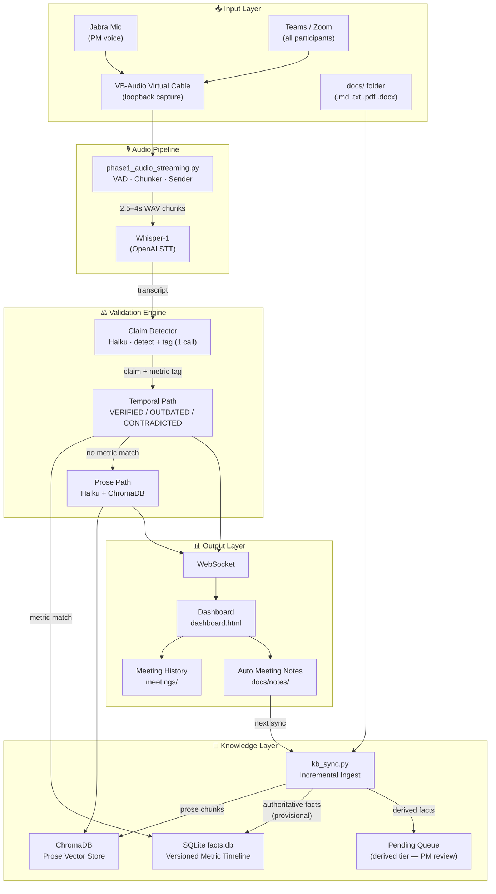

# Geppetto 3 — High-Level Overview

---

## 1. How It Works

**End-to-end flow:**
1. VB-Cable captures all call audio (participants + PM); Jabra handles PM's mic into the call.
2. The audio streamer applies VAD and sends 2.5–4s WAV chunks to the FastAPI server.
3. Whisper-1 transcribes each chunk; the incremental claim detector finds checkable facts.
4. One Haiku call detects claims **and** tags their metric key/value/unit simultaneously.
5. Claims are validated concurrently — temporal path first (SQLite timeline), prose fallback (ChromaDB + Haiku).
6. Alerts are pushed via WebSocket to the PM's private dashboard in **~3–5s** from speech.
7. On session end, meeting notes are auto-generated and fed back into the knowledge base.

---

## 2. Technical Stack

| Layer | Technology | Role |
|---|---|---|
| **Runtime** | Python 3.12 · Windows 11 | Local-first execution; 3.12 required for PyAudio wheels |
| **API Server** | FastAPI + Uvicorn | REST endpoints + WebSocket in one process |
| **Async** | asyncio + `asyncio.to_thread` | Non-blocking STT and concurrent claim validation |
| **Audio Capture** | PyAudio + VB-Audio Virtual Cable | Loopback capture of all call participants |
| **VAD / Chunking** | Custom rolling-RMS VAD | 2.5–4s speech-aligned chunks, 0.5s overlap |
| **Speech-to-Text** | OpenAI Whisper-1 | Reliable numeric transcription (gpt-4o family corrupts numbers) |
| **Claim Detection** | Anthropic Claude Haiku | Detects claims **and** tags metric key/value/unit in one call |
| **Claim Validation** | Anthropic Claude Haiku | Prose-path classification against ChromaDB context |
| **Vector Store** | ChromaDB (persistent) | Semantic search over prose knowledge (SOW, ADRs, process docs) |
| **Fact Store** | SQLite (`facts.db`) | Versioned metric timeline; VERIFIED / OUTDATED / CONTRADICTED resolution |
| **Doc Ingest** | kb_sync.py + pymupdf + python-docx | Incremental SHA256-based sync; supports .md .txt .pdf .docx |
| **Frontend** | Vanilla JS + CSS (single HTML file) | Real-time dashboard; no build step |
| **Real-time Push** | WebSocket (FastAPI native) | Server-push alerts; no polling |
| **Launch** | `start.bat` | One command — server + browser; streamer auto-starts on session begin |
| **Secret Management** | `.env` + `.gitignore` | API keys never committed; GitHub Push Protection enforced |
